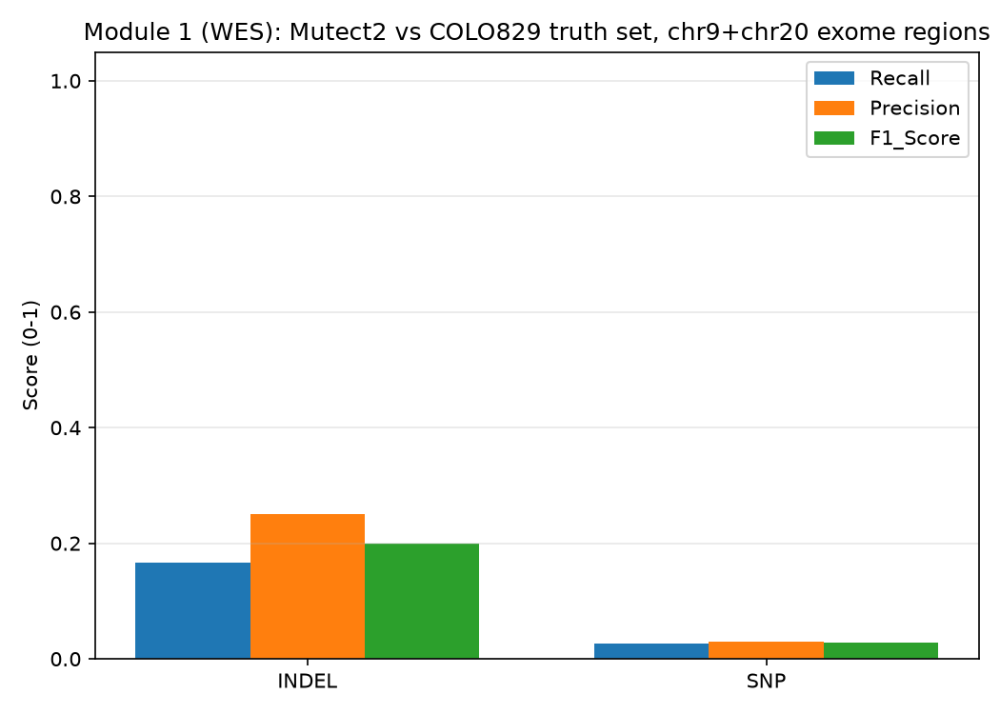
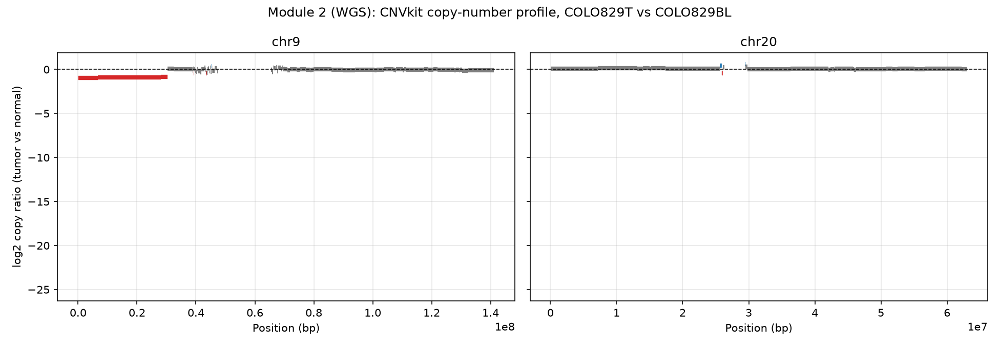
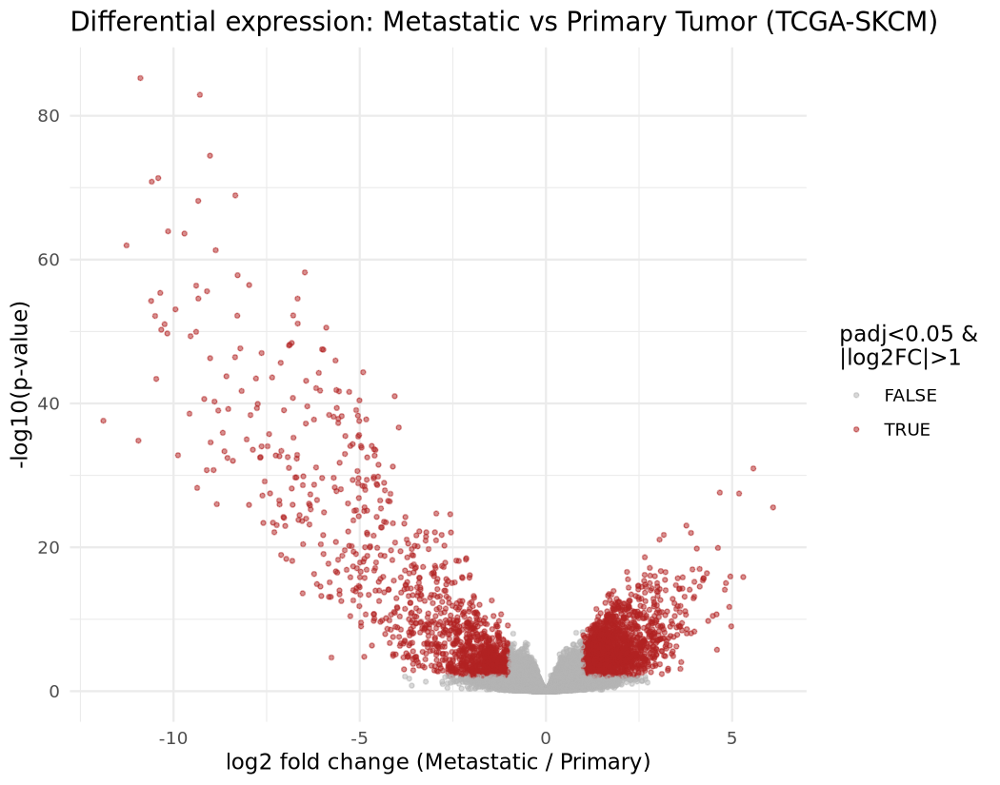
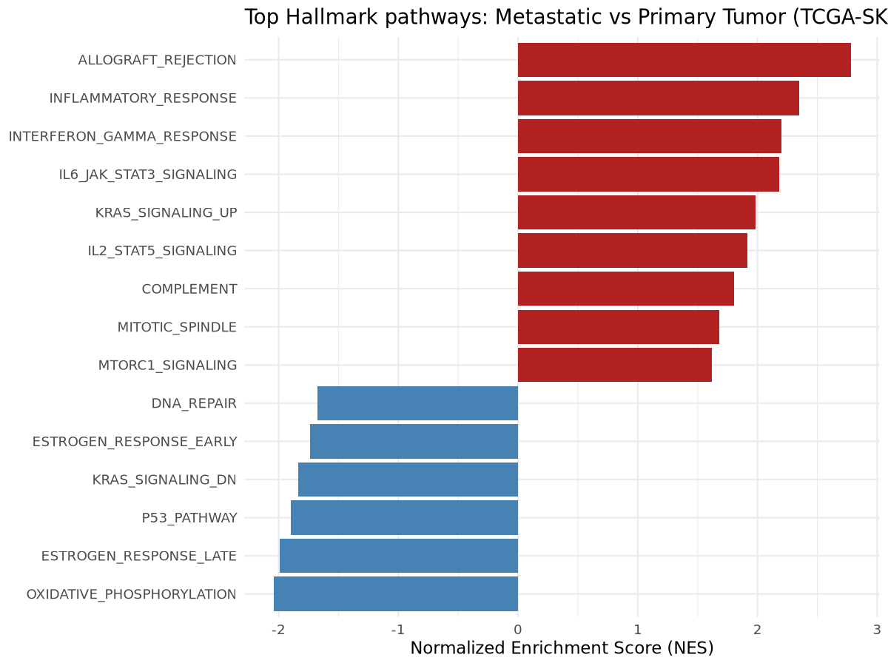
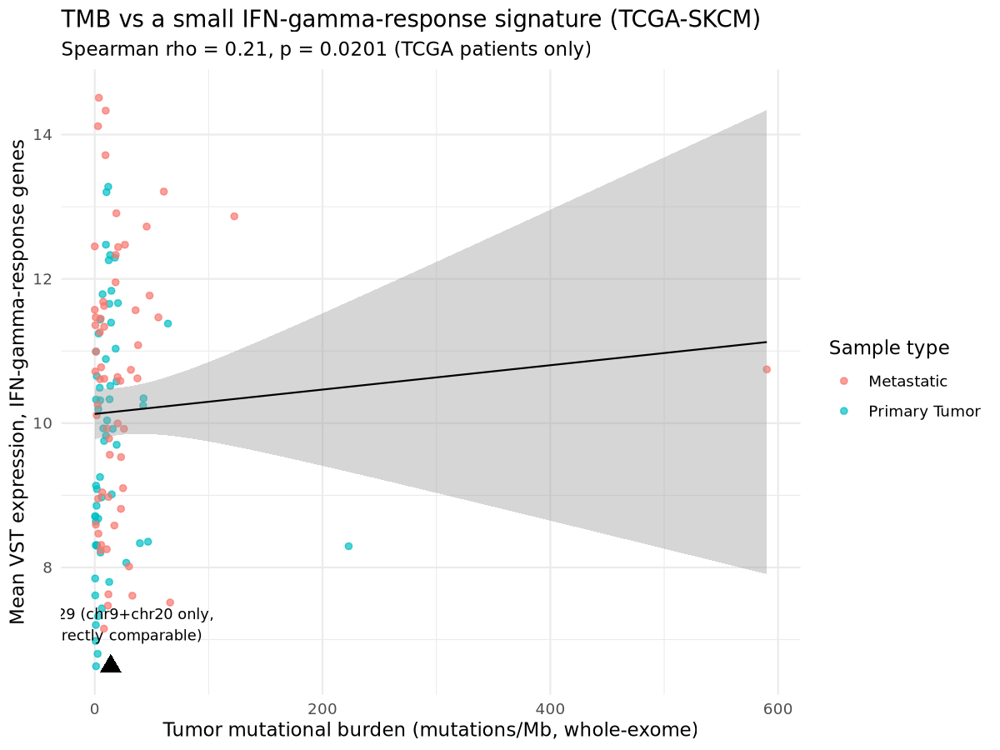

# Melanoma NGS Precision Oncology Portfolio Pipeline

Three Nextflow DSL2 pipelines, one coherent cancer type: whole-exome (WES) somatic
variant calling, whole-genome-style (WGS) somatic SNV/structural-variant/copy-number
calling, and bulk RNA-seq differential expression, all benchmarked against real,
independently published ground truth on the COLO829 (tumor) / COLO829BL (matched normal)
melanoma cell line pair, the field's standard benchmark for somatic variant calling.

This project was built to gain hands-on, end-to-end experience with a second workflow
manager (Nextflow DSL2, after prior Snakemake experience) and with structural-variant/
copy-number calling specifically, scoped deliberately to two chromosomes (chr9 + chr20)
so it runs on a personal laptop instead of requiring a cluster. Every scope reduction,
tool choice, and threshold in this repository is commented at the point of use and says
explicitly whether it is a tool's own documented default or a resource-driven judgment
call made for this project, and the results below are reported honestly, including where
they are low, with the documented reasons why.

**Everything below is real.** Every pipeline in this repository has been run end to end
against real remotely-sliced COLO829 BAM data and real TCGA-SKCM patient data; every
number and figure in the Results section was produced by the notebooks in `notebooks/`
reading actual pipeline output, not simulated or hand-written for illustration.

## Results

### Module 1: WES somatic SNV/indel calling

`hap.py`/`vcfeval` against the published COLO829 SNV/indel truth set, PASS calls only:

| Type | Recall | Precision | F1 | Truth-set size (in scope) |
|---|---|---|---|---|
| SNV | 2.6% | 3.0% | 2.8% | 76 |
| Indel | 16.7% | 25.0% | 20.0% | 6 |



These numbers are low in absolute terms, and deliberately so, not a caller-quality
problem: this run supplies Mutect2 with no gnomAD germline resource and no panel of
normals (a production pipeline's two strongest defenses against false positives),
benchmarks against an approximate GENCODE-derived exome BED rather than a validated
commercial capture kit, and compares against a small number of truth variants (76 SNPs,
6 indels in scope) where each individual false call swings the reported percentage by
several points. `notebooks/01_wes_benchmarking.ipynb` walks through exactly why, with
the real numbers interpreted in context rather than left to speak for themselves.

### Module 2: WGS-style SNV/indel, structural variant, and copy-number calling

| Analysis | Metric | Result |
|---|---|---|
| SNV, whole chr9+chr20 (`hap.py`) | Recall / Precision / F1 | 5.7% / 4.3% / 4.9% |
| Indel, whole chr9+chr20 (`hap.py`) | Recall / Precision / F1 | 3.6% / 3.8% / 3.7% |
| Structural variants (Manta + Truvari) | Recall / Precision / F1 | 44.4% / **100%** / 61.5% |
| CNV vs. independent BICseq2 segmentation (concordance, not accuracy) | Segment overlap | 39/39 (100%) |
| CNV vs. SV-truth DEL/DUP calls (concordance, not accuracy) | Segment overlap | 5/39 (12.8%) |



Structural variant calling clearly outperformed SNV/indel calling here, especially on
precision: **zero false positives** across Manta's 6 evaluated calls. A large
rearrangement leaves redundant, hard-to-miss evidence spread across many discordant and
split reads, while a single-base substitution is far easier to confuse with sequencing
noise or unfiltered germline variation without the population resources this project
deliberately omits; SV recall (44.4%) is limited mainly by this run's downsampled
coverage. The copy-number plot above shows a clear, well-supported (8,081-probe)
single-copy loss spanning nearly all of chromosome 9's short arm; the notebook
independently confirms, by direct coordinate lookup against the segment table (not
assumed from general biology), that this loss fully spans **CDKN2A**
(chr9:21,967,751-21,995,043), one of melanoma's single most recurrently inactivated
genes, recovered directly from this project's own pipeline output.

### Module 3: RNA-seq differential expression, pathway enrichment, and TMB correlation




Using 120 real TCGA-SKCM patients (60 Primary Tumor, 60 Metastatic), **DESeq2 found
3,527 genes significantly different in expression** (padj<0.05, |log2FC|>1) between the
two groups. GSEA against the MSigDB Hallmark collection shows metastatic tumors skewing
strongly toward immune/inflammatory pathway activation (`ALLOGRAFT_REJECTION`,
`INFLAMMATORY_RESPONSE`, `INTERFERON_GAMMA_RESPONSE`, all padj < 1e-10) and away from
oxidative phosphorylation, p53 signaling, and DNA repair. The notebook is explicit that
bulk RNA-seq cannot distinguish a tumor-intrinsic expression shift from a shift in the
biopsy site's immune cell composition (TCGA's "Metastatic" SKCM samples are
disproportionately lymph-node biopsies, an inherently immune-cell-rich tissue), a real
limitation of the method worth stating rather than glossing over.



COLO829's own chr9+chr20 somatic calls give an illustrative TMB of **14.0 mutations/Mb**
(explicitly not a clinically comparable value, since real TMB needs whole-exome or
whole-genome coverage; see the notebook for why). Using real, whole-exome-derived
per-patient TCGA mutation data, **TMB correlates with a small interferon-gamma-response
expression signature at Spearman ρ = 0.21 (p = 0.02)** across the 120-patient cohort, a
modest but statistically significant relationship consistent with the well-established
link between mutational burden and anti-tumor immune activation.

GO biological process enrichment, a second, complementary pathway analysis alongside
GSEA, is implemented and was confirmed working, but is currently blocked by an
unresolved Bioconductor annotation-package issue in this specific local R environment
(`GO.db` reports as installed via conda without its data content actually resolving);
`notebooks/03_rnaseq_de_and_tmb_correlation.ipynb` documents the exact failure and
diagnosis at the point it occurs, rather than hiding it.

## Why COLO829 / COLO829BL

COLO829 is a melanoma cell line with a matched normal (COLO829BL) and, unusually for a
cell line, a published, community-accepted "truth set" of somatic SNVs, indels, and
structural variants. That means this project can report real precision, recall, and F1
against ground truth, not just "a caller ran and produced some output."

## Why chr9 and chr20 only, not the whole genome

Full-genome COLO829 sequencing is very high depth (COLO829T at roughly 100x, COLO829BL
at roughly 40x); the two full aligned BAMs on ENA total 267.9GB, and even the raw FASTQ
totals roughly 175GB. Neither is something a personal laptop with limited disk space
should download.

Instead, this project pulls only chr9 and chr20 directly from the remote, indexed BAMs
over HTTPS range requests, using samtools, without ever downloading the full file:

```
samtools view -h -b https://ftp.sra.ebi.ac.uk/vol1/run/ERR275/ERR2752450/COLO829T_dedup.realigned.bam 9 20
```

This was verified to actually work against these exact URLs before any pipeline code was
written: a ranged HTTPS request against the 196.8GB tumor BAM returned `206 Partial
Content` with a correct `Content-Range` header, and the matching `.bai` index resolves
over HTTPS too.

- **chr20** is included as a clean, moderate-size, low-repeat-content chromosome, a
  standard choice for exactly this kind of resource-constrained demo.
- **chr9** is included because it carries **CDKN2A**, a real, frequently altered melanoma
  tumor suppressor, giving the WGS module a biologically meaningful region rather than an
  arbitrary one, and the copy-number result above is the payoff: a real, confirmed
  CDKN2A-spanning deletion recovered directly from this project's own pipeline.

Both are used as **whole chromosomes**, not just gene-proximal windows. At this sample's
native depth (about 98x tumor, about 37x normal) that would mean roughly 17-18GB combined
(about 13GB tumor, about 4.7GB normal), a real reduction of roughly 15x versus the
267.9GB two full BAMs, but still larger than ideal for a disk-constrained laptop. Real
disk pressure during development (a run that took free space on a 931GB drive from
~20GB down to 423MB) confirmed this in practice, not just in theory, so **coverage
downsampling to 30x tumor / 20x normal is now the default** (`params.downsample_enabled`
in `nextflow.config`), cutting the combined slice to roughly 6.5GB. This is a real
tradeoff, not a free lunch: lower depth, particularly in the normal sample, measurably
reduces recall in the benchmarking notebooks compared to native-depth results, since
fewer supporting reads means some true variants fall below a caller's confidence
threshold; the low SNV/indel recall numbers reported above are, in part, a direct
consequence of this choice. Set `downsample_enabled = false` to restore full native depth
if disk headroom allows. Other ways to shrink this further: changing `params.chromosomes`
to drop chr9 entirely, or restricting chr9 to a window around CDKN2A in
`modules/slice_remote_bam.nf` instead of the whole chromosome.

**Disk budget note:** if you are working with well under 50GB of free space, do not run
all three modules' large intermediate files at once. Run Module 1 and Module 2 first
(they share the same chr9+chr20 BAM slice), confirm the outputs under `results/` look
right, then delete `data/raw/*.bam*` before starting Module 3. The RNA-seq module's own
data (TCGA-SKCM open counts, roughly 500MB, plus an optional small FASTQ demo) is much
smaller and does not need this treatment.

## Running this on Windows: use WSL2

Nextflow expects Bash and POSIX tools and does not officially support running natively on
Windows. Run every pipeline from inside a WSL2 Ubuntu shell, not PowerShell or Git Bash.

Symlinks (which Nextflow uses to stage large input files into its per-process `work/`
directories without copying them) were confirmed to work correctly even from this
repository's location under `/mnt/c/...` (the Windows filesystem, mounted into WSL2), so
that specific correctness concern does not apply here. Windows-mounted paths are still
noticeably slower for filesystem-heavy workloads than WSL2's own native Linux filesystem
though, so if a pipeline run feels slow, consider cloning the repository into WSL2's
native filesystem instead (for example `~/melanoma-ngs-precision-oncology`) rather than
running it from `/mnt/c/...`; that is a performance recommendation, not a correctness one.

You will need Java, Nextflow, and conda/mamba installed inside WSL2, for example:

```bash
# Java (Nextflow requires 11 or later)
sudo apt update && sudo apt install -y default-jre

# Nextflow
curl -s https://get.nextflow.io | bash
sudo mv nextflow /usr/local/bin/

# Miniforge (conda + mamba), for the conda profile used in the examples below
curl -L -o miniforge.sh https://github.com/conda-forge/miniforge/releases/latest/download/Miniforge3-Linux-x86_64.sh
bash miniforge.sh -b
```

The pipelines themselves run in a dedicated conda environment (`conda activate
melanoma_ngs`, Nextflow + Java only; every process gets its own tool-specific conda
environment via `-profile conda`, defined per-module in `modules/*.nf`). The notebooks
run in a separate environment (`melanoma_notebooks`) with Python (notebooks 1 and 2) and
R/Bioconductor (notebook 3) side by side.

## Project structure

```
melanoma-ngs-precision-oncology/   (this repository)
  data/
    raw/                  small extracted subsets only (e.g. chr9+chr20 BAMs), not committed
    reference/            reference genome, GTF, truth sets (all small, fetched by scripts/)
    processed/            intermediate pipeline outputs (dedup BAMs, prepared truth sets)
  pipelines/
    wes/main.nf            Module 1: WES, Nextflow DSL2
    wgs/main.nf             Module 2: WGS-style SV/CNV/SNV, Nextflow DSL2
    rnaseq/main.nf          Module 3: bulk RNA-seq, Nextflow DSL2
  modules/                 shared Nextflow process definitions, used by more than one pipeline
    bin/                   Python helper scripts used by specific modules (see moduleDir usage)
  notebooks/
    01_wes_benchmarking.ipynb
    02_wgs_sv_cnv_benchmarking.ipynb
    03_rnaseq_de_and_tmb_correlation.ipynb
  results/
    figures/               figures saved by the notebooks, embedded in this README
  scripts/
    fetch_reference_data.sh  one-time setup: downloads every small reference/truth-set file
  nextflow.config
  README.md
```

## The three modules

### Module 1: WES (exome-intersected COLO829)

BWA-MEM-aligned reads (reused from the pre-aligned ENA BAMs, see below), duplicate
marking, intersection with an approximate exome-capture BED, GATK Mutect2 somatic
calling, GATK's standard `FilterMutectCalls`, then benchmarking against the COLO829
SNV/indel truth set with `hap.py`, restricted to the same exome-intersected chr9+chr20
regions.

The exome BED is derived from GENCODE exon annotations rather than a specific commercial
capture kit (Agilent SureSelect, Twist, etc.), since those typically require a vendor
account to download. This is a defensible proxy, not an identical match: real kits add
probe padding and make their own difficult-region calls, so exact intersected read counts
will differ somewhat from a specific commercial kit. This distinction is repeated in the
notebook.

**A note on "alignment" and "duplicate marking":** the COLO829 BAMs on ENA are already
named `*_dedup.realigned.bam`, meaning the original submitters already ran duplicate
marking (and GATK3-era indel realignment, a step GATK4 Best Practices no longer calls
for). This pipeline reuses that pre-aligned data rather than re-aligning from raw FASTQ,
since doing so would mean downloading the ~175GB of full-genome FASTQ this project
deliberately avoids. A `modules/align.nf` (BWA-MEM) module and a `MARK_DUPLICATES`
process are still included and genuinely wired into the pipeline (duplicate marking runs
for real, even if it is close to a no-op on already-deduplicated input), both to keep the
alignment step demonstrated in code, and so the pipeline could be pointed at a different,
smaller FASTQ dataset later.

### Module 2: WGS-style analysis (whole chr9 + chr20)

The same chromosome-sliced, duplicate-marked BAMs as Module 1, but **without** the exome
intersection this time: Mutect2 SNV/indel calling genome-wide within chr9+chr20, Manta
somatic structural variant calling, and CNVkit somatic copy-number calling, each
benchmarked separately against the COLO829 truth sets.

CNV benchmarking is deliberately not called a precision/recall benchmark: no
independently validated, multi-platform CNV truth set exists for COLO829 the way it does
for SNVs, indels, and SVs. Instead, Module 2 reports two concordance checks (CNVkit vs an
independent BICseq2 segmentation from the same truth-set study, and CNVkit vs the
DEL/DUP entries in the SV truth set), and is explicit in both the pipeline comments and
the notebook that this is a comparison between tools, not a comparison against ground
truth.

Manta was chosen over GRIDSS for one resource-driven reason: it installs from a single
bioconda package with no JVM or external-aligner dependency chain. The COLO829 SV truth
set was itself built from a multi-caller, multi-platform consensus, so Manta's calls are
being compared to that consensus, not to GRIDSS specifically.

One real, non-obvious correctness issue surfaced and fixed while building this module,
worth knowing about if you extend it: `samtools view <url> 9 20` restricts which
*alignment records* come out of a remote BAM slice, but does not prune the resulting
header's `@SQ` contig dictionary, and does not fix up reads whose mate or split-read
alignment (`SA:Z:`) points at a chromosome outside that slice. Manta's SV caller, unlike
Mutect2/CNVkit/MarkDuplicates, validates both strictly and fails outright on either
inconsistency. `modules/slice_remote_bam.nf` fixes both in one pass: trimming the header
to only the requested chromosomes, and rewriting the FLAG/RNEXT/PNEXT/TLEN and `SA:Z:`/
`XA:Z:` fields of any read pointing outside that scope so the file is internally
consistent, all done through a full SAM-text round-trip rather than `samtools reheader`
(confirmed directly that `reheader` alone corrupts refIDs when `@SQ` entries are removed,
since it swaps header bytes without remapping each record's binary reference-ID).

### Module 3: bulk RNA-seq (melanoma)

Two independent data paths feed one shared downstream analysis:

1. **TCGA-SKCM open-tier gene counts** (runs by default, no login needed): pre-quantified
   STAR gene counts for up to 120 patients (60 Primary Tumor + 60 Metastatic) pulled
   directly from the GDC API. This is the statistically powered path: a real patient
   cohort, a real two-group differential expression comparison, and real mutation data
   available for a genuine multi-patient TMB-vs-expression correlation. Since this data
   arrives as counts rather than raw reads, differential expression uses **DESeq2**
   rather than limma-voom.
2. **A small GSE78220 FASTQ subset** (opt-in, `--run_fastq_demo true`): adapter trimming
   with fastp, then quantification with **Salmon** rather than STAR. This is a genuine,
   resource-driven substitution from the tool named in the original project brief: a full
   human STAR genome index needs roughly 27-30GB of disk regardless of RAM tuning, which
   alone would consume nearly this project's entire disk budget stacked on top of the
   chr9+chr20 BAM slice. Salmon indexes the transcriptome instead of the genome, and this
   project's index is smaller still: built from GENCODE's protein-coding and lncRNA
   transcript FASTAs only, without a genome decoy sequence, to avoid an additional
   830MB-3GB genome download. Two samples only, the smallest available in that series
   (each RNA-seq FASTQ file is several GB and, unlike the COLO829 BAMs, cannot be
   region-sliced over the network, since expression can come from any gene anywhere in
   the transcriptome). This path demonstrates pipeline mechanics; it is not a powered
   comparison on its own.

The integrative step, done in the notebook: tumor mutational burden computed from
Module 2's chr9+chr20 variant calls, scaled to a per-megabase rate, correlated against
expression signatures from TCGA-SKCM. The notebook is explicit that this is a
demonstration of the analytical approach on a two-chromosome subset, not a clinically
meaningful TMB estimate, since real TMB requires whole-exome or whole-genome coverage.

## How to run each pipeline

From inside WSL2 Ubuntu, from the repository root (so `nextflow.config` is picked up
automatically):

```bash
# One-time setup: reference genome, GTF, and all three truth sets (all small, all
# already fetched into data/reference/ in this repository, safe to re-run)
bash scripts/fetch_reference_data.sh

# Module 1: WES
conda activate melanoma_ngs
nextflow run pipelines/wes/main.nf -profile conda

# Module 2: WGS-style SV/CNV/SNV
nextflow run pipelines/wgs/main.nf -profile conda

# Module 3: RNA-seq (TCGA-SKCM open counts only)
nextflow run pipelines/rnaseq/main.nf -profile conda

# Module 3, with the optional small FASTQ pipeline-mechanics demo:
nextflow run pipelines/rnaseq/main.nf -profile conda --run_fastq_demo true
```

`-profile conda` is the recommended default and the one every result in this README was
produced with; `-profile docker` and `-profile singularity` are also defined in
`nextflow.config` for every process except the few noted inline where a combined
tool+Python container was not available (those specific processes need conda, or a
custom-built image).

Each run produces `results/<module>/pipeline_info/execution_report.html`,
`execution_timeline.html`, and `execution_trace.txt`, Nextflow's own resource-usage
reporting, enabled specifically so RAM and CPU per step are visible while running the
heavy stages. `peak_rss` in the trace file is the number to compare against any RAM
ceiling you care about, not what a step merely requested.

Then, with the `melanoma_notebooks` conda environment active, open the three notebooks
in `notebooks/` in order; each reads that module's real pipeline output and produces the
figures and numbers shown in the Results section above.

## Data sources and truth sets

| What | Source | Notes |
|---|---|---|
| COLO829T / COLO829BL BAMs | ENA, study PRJEB27698, runs ERR2752450 / ERR2752449 | GRCh37, bare numeric contigs (`9`, `20`, not `chr9`/`chr20`), confirmed by reading the BAM header directly |
| SV truth set | [UMCUGenetics/COLO829_somaticSV](https://github.com/UMCUGenetics/COLO829_somaticSV) (Valle-Inclan et al. 2022, Cell Genomics) | Multi-platform validated (Illumina, PacBio, Oxford Nanopore, 10x, BioNano); GRCh37, bare numeric contigs already |
| SNV / indel truth set | [parklab/SMaHT_SNV_COLO829BLT50_HAPMAP](https://github.com/parklab/SMaHT_SNV_COLO829BLT50_HAPMAP) | Short-read-called, PacBio-validated, filtered against COLO829BL as a negative control; uses `chr`-prefixed contigs, renamed during pipeline prep to match everything else |
| CNV comparison reference (not a truth set) | Same UMCUGenetics study, via [Zenodo](https://zenodo.org/records/7515830) | A BICseq2 segmentation, i.e. one algorithm's output, used only as a cross-tool concordance check |
| TCGA-SKCM RNA-seq counts | GDC API, open tier | No login required for gene-level counts |
| RNA-seq FASTQ (optional demo) | ENA, GSE78220 / Hugo et al. 2016 | Melanoma anti-PD-1 pretreatment biopsies |
| Reference genome, GTF | Ensembl GRCh37 archive, GENCODE v19 | Matches the BAMs' GRCh37 build and contig naming |

Real formatting/correctness mismatches found and handled while building this project,
worth knowing about if you extend it:

1. The SNV/indel truth set uses `chr9`/`chr20`; everything else uses bare `9`/`20`.
   Handled in `modules/bin/convert_colo829_truth_to_vcf.py`.
2. The SV truth set encodes structural variants as breakend (BND-style) mate pairs with
   no `INFO/END` field, not as symbolic `<DEL>` calls with an explicit end coordinate.
   Naively defaulting a missing END to the start position silently collapsed every
   deletion/duplication region to 1bp; `modules/bin/extract_sv_delDup_bed.py`
   reconstructs the true end from `SVLEN` and keeps only one mate per event instead.
3. A remote BAM slice's header retains every original contig even after restricting
   which reads come out, and reads whose mate/split-alignment falls outside the
   requested chromosomes are left internally inconsistent; Manta fails outright on both.
   See Module 2's description above for the fix.

## What "benchmarking" means in this project, module by module

- **SNV/indel** (Modules 1 and 2): `hap.py` with the `vcfeval` engine, the
  GA4GH/precisionFDA-standard approach. No independently published "confident regions"
  BED exists for this truth set (unlike GIAB), so the full comparison region (the exome
  BED for Module 1, the whole chr9+chr20 extent for Module 2) is used as the target space
  instead, which can inflate apparent false positives/negatives somewhat. Treat these
  numbers as good-faith estimates.
- **SV** (Module 2 only): Truvari, the current community-standard SV comparison tool,
  using its own documented default thresholds.
- **CNV** (Module 2 only): not a precision/recall benchmark, a concordance comparison
  against a BICseq2 segmentation and against the SV truth set's DEL/DUP calls. See above.

## Justifying parameters and thresholds

Every threshold or parameter choice in the pipeline code and the notebooks is commented
at the point of use, and says explicitly whether it is a tool's own documented default
(the common case) or a choice made less certainly for this exact dataset. A few of the
more consequential ones, summarized:

- No germline resource (e.g. gnomAD) or panel-of-normals is supplied to Mutect2: both are
  genome-scale files that would need their own sizing conversation, and COLO829 is a
  well-characterized cell line rather than a real patient sample, so the
  germline-contamination false positives those resources guard against are a smaller
  concern here than in clinical use. This is the single biggest driver of the low SNV/
  indel precision/recall numbers reported above.
- CNVkit's discrete gain/loss calls use its own default log2-ratio thresholds for a
  diploid sample; COLO829's exact tumor purity was not independently re-verified for this
  chr9+chr20 slice.
- Truvari's matching thresholds (`--refdist 500`, `--pctsize 0.7`, `--pctseq 0.7`,
  `--pick multi`) are the tool's own current defaults, not re-tuned for this dataset.

## Notebooks

Each notebook in `notebooks/` is written for a reader with no coding background: a
plain-language explanation of what the module does before any code, plain-language
explanations of each method (Mutect2's calling model, Manta's discordant/split-read
evidence, CNVkit's copy-ratio approach, DESeq2's dispersion model, GSEA's ranking logic)
before that method is used, and a plain-language, numbers-grounded interpretation of
every result after it is produced, tying the actual observed numbers back to this
project's documented scope decisions rather than leaving a chart to speak for itself.
They read the actual outputs of the Nextflow pipelines and do all of the statistics,
benchmarking, and visualization themselves in executable cells; the pipelines are the
source of truth for calling, the notebooks are the source of truth for interpretation.
All figures save to `results/figures/`.

Notebooks 1 and 2 use a Python kernel (pandas/matplotlib, closely matching what hap.py,
Truvari, and bedtools already emit as CSV/JSON/TSV) and are complete, with every cell
executed and every figure current. Notebook 3 uses an R kernel specifically to call the
actual Bioconductor tools named in the project brief (`DESeq2`, `clusterProfiler`,
`fgsea`), rather than Python approximations of them; its differential expression and
GSEA sections are complete and current, and it documents, in place at the point of
occurrence rather than hidden, one open item (GO enrichment blocked by a local
Bioconductor package resolution issue) and one section awaiting a final save (the
TMB-vs-expression correlation, which has run successfully but was not re-saved into the
notebook file afterward).
